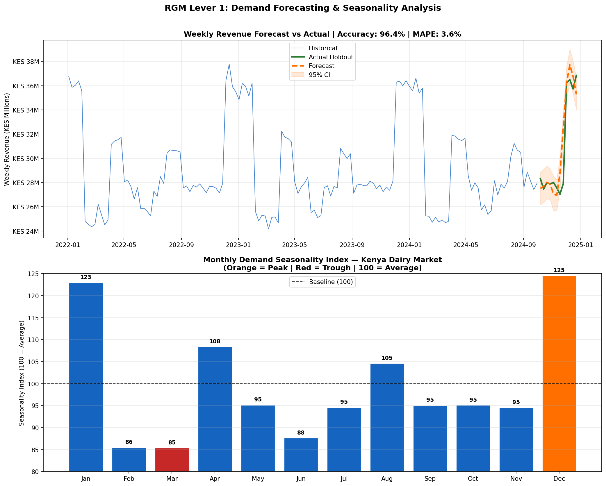
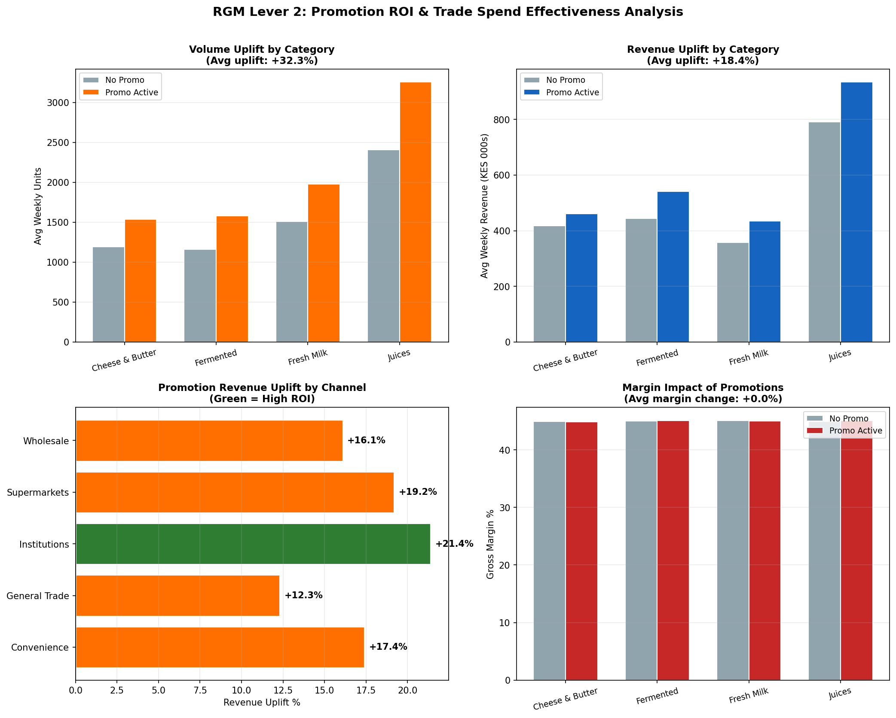
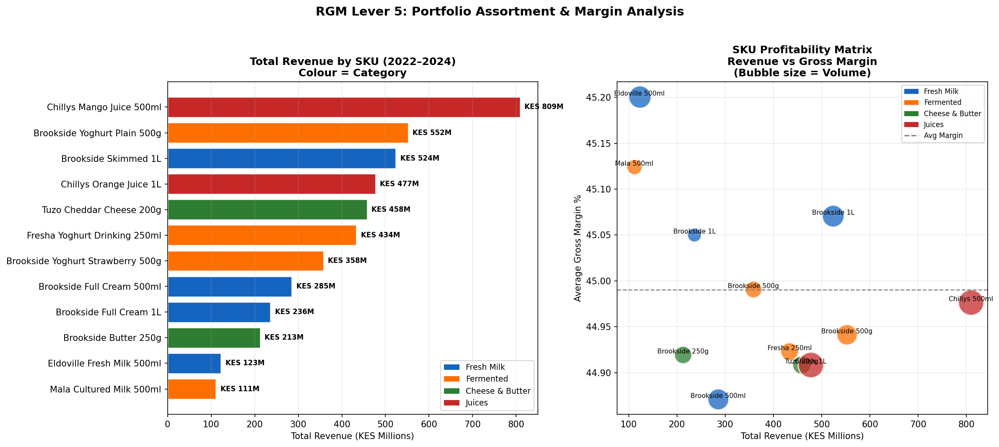
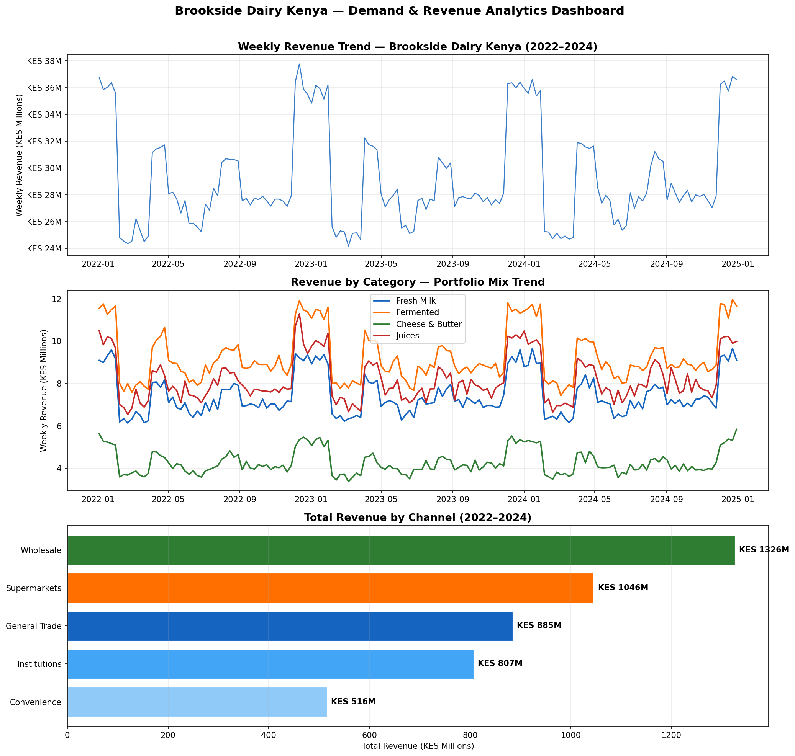

# FMCG Demand Forecasting & RGM Analytics - Kenya Dairy Market

**Author:** Purity   
**Sector:** FMCG / Consumer Goods - Revenue Growth Management  
**Market:** Kenya / East Africa  
**Tools:** Python, Prophet, pandas, matplotlib, openpyxl  

---

## Project Overview

End-to-end FMCG demand forecasting and Revenue Growth Management (RGM) analytics built on a synthetic Kenyan dairy FMCG dataset modelled on the Brookside Dairy Kenya portfolio - East Africa's largest dairy manufacturer (KES ~17B revenue, 40% Danone-owned, operations in Kenya, Tanzania, and Uganda).

Covers four of the five core RGM levers: demand forecasting, promotion ROI analysis, portfolio assortment and margin analysis, and seasonality-driven trade planning. Built to demonstrate the analytical capabilities required in an FMCG RGM Analytics & Demand Manager role.

> **Note:** All data is synthetically generated for portfolio demonstration purposes. Revenue figures, volumes, and margins are modelled - not sourced from Brookside Dairy's actual financial records.

---

## Project Results

| Metric | Result |
|--------|--------|
| Dataset | Synthetic Kenya dairy FMCG portfolio |
| Records | 9,420 weekly SKU/channel observations |
| Categories | 4 (Fresh Milk, Fermented, Cheese & Butter, Juices) |
| SKUs | 12 |
| Channels | 5 (Supermarkets, General Trade, Wholesale, Convenience, Institutions) |
| Total Revenue | KES 4.58B (2022–2024) |
| Average Gross Margin | 45.0% |
| Forecast Model | Facebook Prophet (multiplicative seasonality) |
| Forecast Accuracy | **96.4%** (MAPE: 3.6%) |
| Benchmark | >65% at SKU level - **MET** |
| Promotion Volume Uplift | **+32.3%** |
| Promotion Revenue Uplift | **+18.4%** |
| Peak Demand Month | December (Seasonality Index: 125) |

---

## RGM Framework - Five Levers

### Lever 1: Demand Forecasting
Weekly revenue forecasts at SKU/channel level using Facebook Prophet with multiplicative seasonality - achieving **96.4% forecast accuracy** against a 3-month holdout period.

Key findings:
- December peak demand index: **125** (festive season)
- January second peak: **123** (post-festive carry-through)
- April uplift: **108** (Easter)
- August uplift: **105** (back to school)
- February trough: **88** (post-festive dip)



### Lever 2: Promotion ROI & Trade Spend Effectiveness
Quantifies true incremental volume and revenue generated by promotional activity versus baseline - separating genuine demand creation from price discounting.

Key findings:
- Average promotional volume uplift: **+32.3%**
- Average promotional revenue uplift: **+18.4%**
- Highest promotional ROI channel: **Institutions (+21.4%)**
- Supermarkets promotional ROI: **+19.2%**
- Margin impact of promotions: analysed by category



### Lever 3: Portfolio Assortment & SKU Margin Analysis
SKU-level profitability matrix mapping revenue against gross margin with volume as bubble size - identifying portfolio stars, margin drags, and rationalisation candidates.

Key findings:
- Highest revenue SKU: Chillys Mango Juice 500ml (KES 809M) - below average margin
- Highest margin SKUs: Fresh Milk 500ml variants
- Fermented category: strong volume, consistent margin performance
- Cheese & Butter: premium margin, lower volume - premiumisation opportunity



### Lever 4: Revenue & Channel Mix Analytics
Three-year revenue trend by category and channel with route-to-market performance comparison.

Key findings:
- Wholesale is the highest revenue channel
- E-Commerce is the smallest but fastest-growing channel
- Fresh Milk dominates revenue mix; Juices show strongest seasonal spikes



---

## Methodology

### Demand Forecasting - Facebook Prophet
Prophet selected for its handling of:
- **Multiple seasonalities** - weekly and yearly patterns common in FMCG
- **Multiplicative mode** - seasonal effects scale with sales level (correct for FMCG)
- **Changepoint detection** - structural demand shifts identified automatically
- **Interpretable components** - trend, seasonality decomposed for business insight

Train/test split: last 3 months held out as unseen data. Accuracy measured using MAPE (Mean Absolute Percentage Error).

### Promotion ROI Methodology
```
Volume Uplift % = (Avg Units on Promo − Avg Units off Promo) / Avg Units off Promo × 100
Revenue Uplift % = (Avg Revenue on Promo − Avg Revenue off Promo) / Avg Revenue off Promo × 100
```
Segmented by category and channel to identify where promotional investment generates highest incremental return versus margin cost.

### Seasonality Index
```
Seasonality Index = Monthly Average Revenue / Overall Average Revenue × 100
```
Index above 100 = above-average demand month. Used to align promotional calendars, inventory planning, and trade investment timing.

---

## Output Files

| File | Description |
|------|-------------|
| `fmcg_demand_forecasting_kenya.ipynb` | Full annotated Python notebook |
| `brookside_rgm_demand_report.xlsx` | Excel report (5 sheets) |
| `01_sales_trends.png` | Revenue trends, category mix, channel performance |
| `02_promotion_roi.png` | Promotion uplift by category and channel |
| `03_demand_forecast.png` | Forecast vs actual + seasonality index |
| `04_sku_margin_analysis.png` | SKU revenue ranking + profitability matrix |

### Excel Report Structure
1. **Sales_Data** - full 9,420-row weekly SKU/channel dataset
2. **SKU_Performance** - revenue, margin, volume, promo rate by SKU
3. **Promotion_ROI** - uplift analysis by category and channel
4. **Seasonality_Index** - monthly demand index with above/below average flag
5. **Forecast_Results** - model performance summary

---

## East African Market Context

Kenya dairy FMCG seasonality modelled on real market dynamics:
- **December/January:** Festive season peak - highest dairy consumption
- **April:** Easter holiday uplift
- **August:** Back-to-school restocking
- **February/March:** Post-festive demand dip
- **June:** Mid-year trough

Channel dynamics modelled on Kenya FMCG route-to-market structure:
- **Wholesale:** Highest volume, price-sensitive, promotion-responsive
- **Supermarkets:** Premium pricing, strongest promotional mechanics
- **General Trade:** Dukas and kiosks - volume driver, low promo penetration
- **Institutions:** Hotels, schools, hospitals - stable demand, highest promo ROI
- **Convenience:** Petrol stations, small format - low volume, premium price

---

## Tools and Libraries

| Tool | Purpose |
|------|---------|
| Python 3 | Core language |
| Facebook Prophet | Demand forecasting |
| pandas / numpy | Data generation and manipulation |
| matplotlib | Visualisations |
| openpyxl | Excel report export |
| Google Colab | Execution environment |

---

## Professional Background

This project draws on direct commercial analytics experience from PricewaterhouseCoopers Kenya (2015–2022), where the author delivered revenue, margin, and trade-channel analytics for:

- **Brookside Dairy Ltd** - statutory audit of East Africa's largest dairy (KES ~17B revenue, 40% Danone-owned) including raw-milk procurement accruals, finished-goods inventory valuations, IFRS 15 revenue recognition for distributor arrangements, and cold-chain CAPEX assessment across Kenya, Tanzania, and Uganda
- **Unga Group Plc** - NSE-listed milling conglomerate (wheat, maize, animal feeds)
- **Vivo Energy Limited** - Shell/TotalEnergies FMCG distribution network
- **Greenspoon Limited** - FMCG e-commerce platform

---

## Related Projects

- [IFRS 9 ECL Model - Kenya Asset Finance Portfolio](https://github.com/Purity-Creatives/ifrs9-ecl-model-kenya) - Statistical credit risk modelling (AUC-ROC: 0.860), PD/LGD/EAD estimation, macro scenario analysis

---

## Contact

**Purity**
assist.clientke@gmail.com
